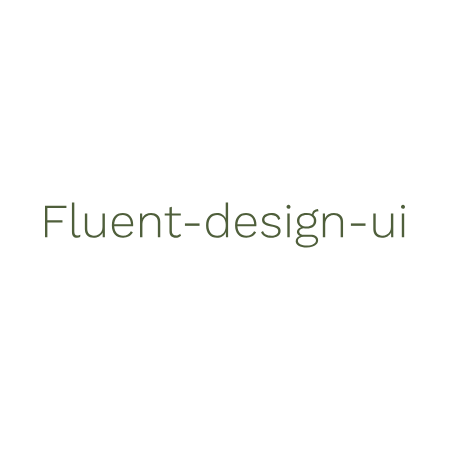

    

<h1 align="center" style="text-align:center;">Fluent Design UI</h1>

    A <a href="https://fluent.microsoft.com/">Microsoft's Fluent Design</a> UI based on <a href="https://vuejs.org/">Vue.js</a>

